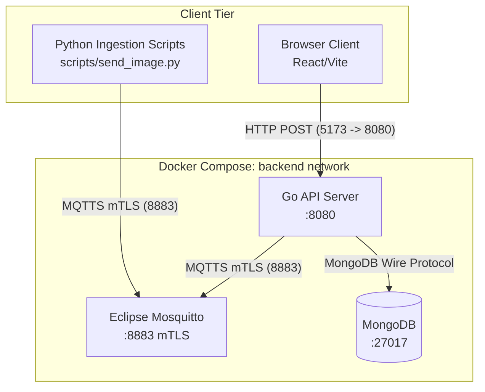
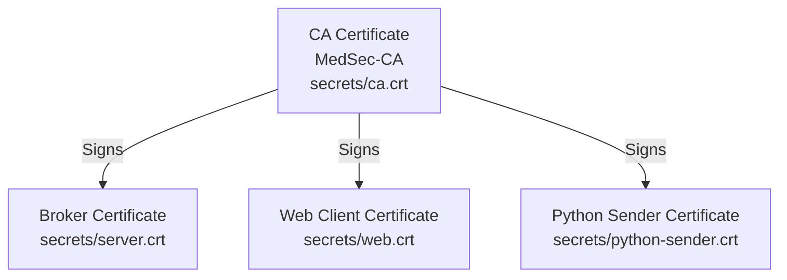

# Infrastructure Overview

## Topology Diagram

## Network Layout
All backend services run on a custom Docker bridge network named `backend`. This provides DNS resolution between containers (e.g., the Go API connects to `mongo-db` and `broker`).

## Port Map

| Port | Protocol | Service | Description |
|------|----------|---------|-------------|
| 5173 | HTTP | Vite Dev Server | Frontend development server (runs natively, not in Docker) |
| 8080 | HTTP | Go API | The main application REST API |
| 8883 | MQTTS | Mosquitto | Mutual TLS secured MQTT listener |
| 27019 | MongoDB | MongoDB | Mapped to 27017 internally. For direct database access via scripts |

*Note: Port 1883 (plaintext MQTT) is intentionally disabled and not exposed.*

## Secret Management
The application strictly separates secrets from code:
- **Environment Variables**: Stored in a `.env` file (not committed to Git). Contains MongoDB passwords and JWT secrets.
- **Certificates**: Stored in the `./secrets/` directory (ignored by Git). They are mounted into containers using Docker Compose `secrets:` configuration, which maps them to `/run/secrets/` inside the container in a read-only, tmpfs-backed manner.

## mTLS Certificate Chain

## Dev vs Prod
Currently, the environment is configured primarily for development and testing. 
For a true production deployment, a `docker-compose.prod.yml` override should be used to:
- Drop the port `27019` mapping (database should not be accessible from the host).
- Configure resource limits (CPU/Memory).
- Enable JSON logging for containers.
