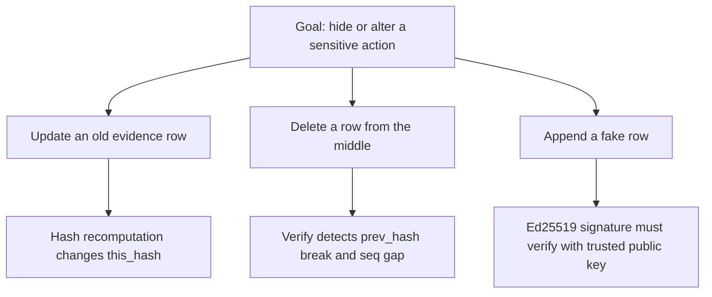

# Attack Tree: Evidence Tampering

```mermaid
flowchart TD
    A["Goal: hide or alter a sensitive action"] --> B["Update an old evidence row"]
    A --> C["Delete a row from the middle"]
    A --> D["Append a fake row"]
    B --> B1["Hash recomputation changes this_hash"]
    C --> C1["Verify detects prev_hash break and seq gap"]
    D --> D1["Ed25519 signature must verify with trusted public key"]
```

Residual risk: if `EVIDENCE_ED25519_PRIVATE_KEY` is not configured, development uses an ephemeral signing key. That is acceptable only for local demos.
