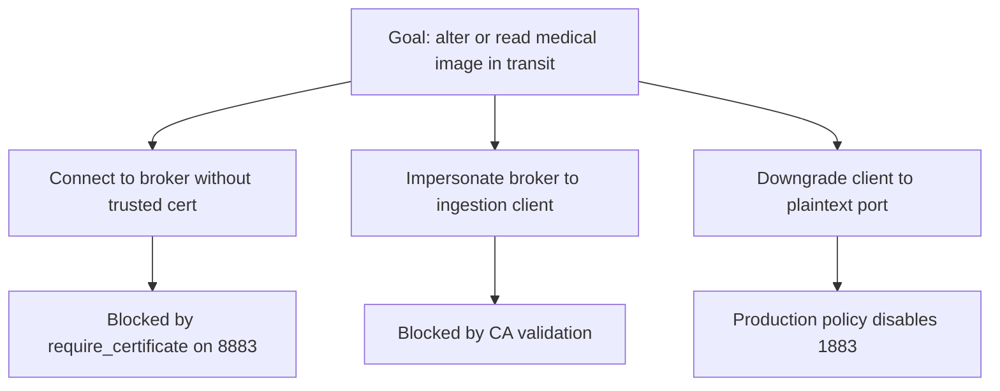

# Attack Tree: MQTT MITM

```mermaid
flowchart TD
    A["Goal: alter or read medical image in transit"] --> B["Connect to broker without trusted cert"]
    A --> C["Impersonate broker to ingestion client"]
    A --> D["Downgrade client to plaintext port"]
    B --> B1["Blocked by require_certificate on 8883"]
    C --> C1["Blocked by CA validation"]
    D --> D1["Production policy disables 1883"]
```

Residual risk: local development may still expose demo paths or weak test certificates. Rotate certificates before external testing.
