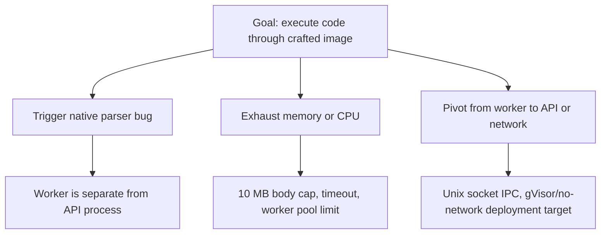

# Attack Tree: OCR Worker RCE

```mermaid
flowchart TD
    A["Goal: execute code through crafted image"] --> B["Trigger native parser bug"]
    A --> C["Exhaust memory or CPU"]
    A --> D["Pivot from worker to API or network"]
    B --> B1["Worker is separate from API process"]
    C --> C1["10 MB body cap, timeout, worker pool limit"]
    D --> D1["Unix socket IPC, gVisor/no-network deployment target"]
```

Residual risk: the current Docker Compose must be extended to run the worker with the hardened `Dockerfile.gvisor` settings in all environments.
